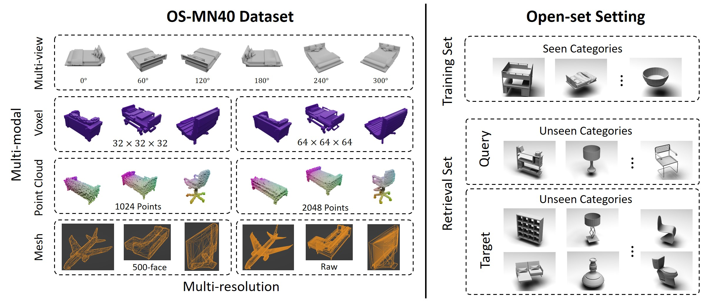

# Introduction
In our paper "SHREC'22: Open-Set 3D Object Retrieval", we have released two datasets for open-set 3D object retrieval. The two datasets are generated based on the [Modelnet40](https://modelnet.cs.princeton.edu/) dataset. Here, we release the core code for multi-modal data generation including **Voxel Modality Generation**, **Pointcloud Modality Generation**, and **24 Images Modality Generation**.

The computed fully datasets can be download [here](https://www.moon-lab.tech/shrec22). Examlpe code can be found [here](https://github.com/yifanfeng97/OS-MN40-Example).



# Settings for generating voxel and pointcloud modalities
Create a virtual environment with command
```bash
conda create -n shrec22 python=3.8
```
Then, activate the environment, and install the following libraries with pip
```bash
pip install open3d, Pillow, numpy, rich, scipy
```

### Usage
Run the following code. The generated voxel and pointcloud will be stored in the `out` direction.
```bash
python generate_voxel_pointcloud.py
```

## Settings for generating 24 images modality
- blender 3.0

Install the PIL library for the inside python in blender. Change the work direction to the direction of the  inside python of blender. Then, run the following command:

```bash
pip install Pillow
```

### Usage
Open `generate_24_images.blend` with blender 3.0, then run the code. Then, rendered 24 images can be found in the `out` folder.

# Evaluation
Given a given distance matrix, you can evaluate its mAP, NDCG, ANMRR, NN with functions in the metrics.py. 


# Citation
```
@article{feng2022shrec,
  title={SHREC’22 track: Open-Set 3D Object Retrieval},
  author={Feng, Yifan and Gao, Yue and Zhao, Xibin and Guo, Yandong and Bagewadi, Nihar and Bui, Nhat-Tan and Dao, Hieu and Gangisetty, Shankar and Guan, Ripeng and Han, Xie and others},
  journal={Computers \& Graphics},
  year={2022},
  publisher={Elsevier}
}
```